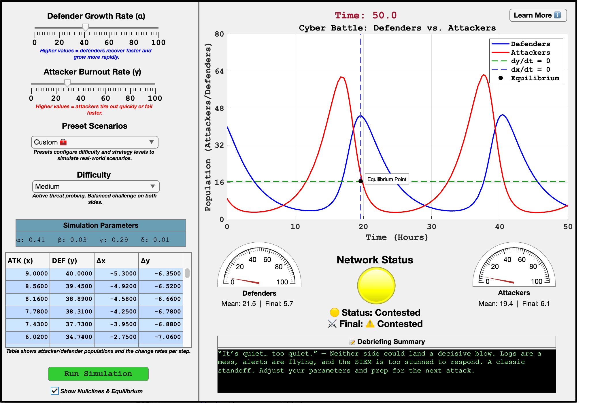
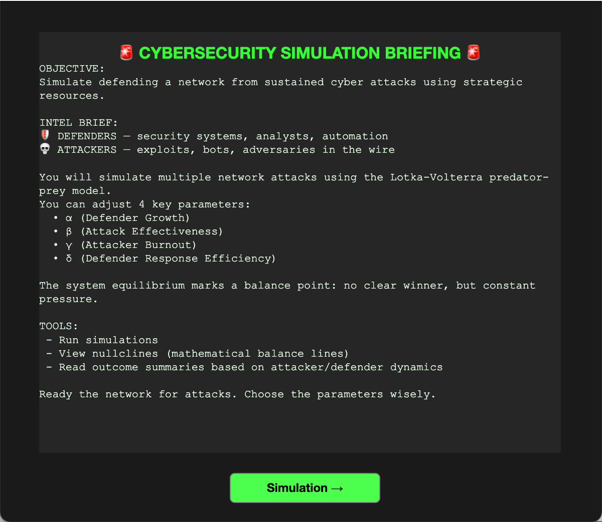

# 🛡️ Defend the Network: A Cybersecurity Simulation using Lotka-Volterra Dynamics

**Author**: Ward Spangenberg  
**Course**: Differential Equations - MA211-700, Spring 2025  
**Status**: In Development

---

## 📌 Project Overview

_Defend the Network_ is an interactive simulation built in MATLAB App Designer that visualizes cyber attack-defense dynamics using the classical Lotka-Volterra predator-prey model. By reinterpreting the predator as **attackers** and the prey as **defenders**, the simulation provides an intuitive and engaging metaphor for real-world cybersecurity battles.

Users can adjust system parameters such as defender growth rate and attacker burnout to observe how strategies affect long-term survival, escalation, or breaches. The simulation is geared toward education, cyber training, and demonstrating complex differential equations in an applied and visual way.


---

## 🧰 The Mathematical Model

This simulation is governed by the Lotka-Volterra equations:

```
dx/dt = αx - βxy  
dy/dt = δxy - γy
```

### Variable Mapping:
- **x(t)**: Defender population (interpreted as firewalls, analysts, response systems)
- **y(t)**: Attacker population (interpreted as threat actors, malware, exploits)

### Parameters:
- **α** – Defender growth rate (resource scaling)
- **β** – Attack surface vulnerability (how often attackers succeed)
- **δ** – Attacker adaptation rate (how fast they improve after success)
- **γ** – Attacker burnout rate (natural decay when thwarted)

---
## 📘 Nullclines & Equilibrium Explanation

- **Nullcline (`dx/dt = 0`)**: Where attacker population stops changing
- **Nullcline (`dy/dt = 0`)**: Where defender population stops changing
- **Equilibrium Point**: Where both attacker and defender populations stabilize — often marks a critical turning point in the simulation dynamics

---

## 🔧 Features

### 📊 Simulation Core
- **Lotka-Volterra Dynamics**: Models attackers vs. defenders using differential equations.
- **Adjustable Parameters**:
  - **Defender Growth Rate (α)** via slider
  - **Attacker Burnout Rate (γ)** via slider
  - **Attacker Behavior** based on difficulty selection (Easy, Medium, Hard)
- **Preset Scenarios** to model real-world threat environments

### 🕹️ User Interface
- **Interactive Sliders**: Control system dynamics with real-time visual feedback.
- **Live Plotting**: Animated attacker and defender population chart over time.
- **Data Table**: Shows current values of attacker (x), defender (y), and Δx/Δy over time.
- **Gauges**: Show population values of attackers and defenders (capped at 100).
- **Status Lamp**: Reflects network health in real time.

### 🧮 Advanced Analysis
- **Toggleable Nullclines & Equilibrium**:
  - `dx/dt = 0` and `dy/dt = 0` lines overlaid on the simulation
  - Equilibrium point marked and annotated on the plot
- **Parameter Display**: Shows α, β, γ, and δ values during the run

### 🧾 Briefing
- A popup briefing appears on app launch providing a “cyber defense mission” narrative
- Explains the simulation objectives and mechanics



### 🧠 Learn More Panel
- Popup with an educational breakdown of:
  - Predator-prey equations and their cybersecurity mapping
  - Role of attackers, defenders, burnout, and engagement
  - Explanation of nullclines and equilibrium in this context


### 🧯 Outcome Narratives
- Summary generation at the end of each simulation with debrief-style feedback depending on success, failure, or contested outcomes.

---

## 💡 Cybersecurity Industry Implications

This simulation isn't just a classroom exercise—it maps directly to real-world cyber defense:

1. **Dynamic Security**: Shows cyber risk as a system, not a snapshot.
1. **Burnout & Fatigue**: Models attacker resource constraints and defender overload.
1. **APTs & Evolution**: Future support for evolutionary AI attackers mirrors real-world persistent threats.
1. **Policy Tuning**: Parameters act as levers (budget, hygiene, AI threat level, etc.)—a new way to think about strategy.
1. **Predictive Risk**: Ingest threat intel and simulate outcomes, providing more accurate cyber forecasting.

🚀 This project reframes cybersecurity defense from “ **build a wall and hope** ” to “ **model a system and be prepared.** ”

---

## ✅ Requirements

- MATLAB R2020a or newer (App Designer support)
- No external toolboxes required

---

## ▶️ How to Run

1. Open `DefendTheNetwork.mlapp` in MATLAB App Designer.
2. Make sure the `+src` folder is in your current MATLAB path:
   ```matlab
   addpath(genpath('path_to/DefendTheNetwork/+src'));
   ```
3. Click **Run** to launch the app.
4. Adjust sliders and difficulty, then hit **Run Simulation**.

---

## 📁 Project Structure

```
DefendTheNetwork/
├── DefendTheNetwork.mlapp       # Main App Designer file
├── README.md                    # Project documentation
├── +src/
│   ├── simulate_lv_dynamics.m   # ODE logic and solution wrapper
│   ├── attacker_ai.m            # Attacker behavior parameter config
│   └── health_status.m          # Status color & label utilities
└── assets/                      # Optional images or icons
```

---
## 🔄 Refactoring Note

As of the latest version, **all major simulation logic has been moved out of the app and into modular files** under the `+src` folder:

| Feature                     | Old Location                      | New Location               |
|----------------------------|-----------------------------------|----------------------------|
| Lotka-Volterra simulation  | Inside App logic                  | `+src/simulate_lv_dynamics.m` |
| Difficulty behavior tuning | Inline conditional logic          | `+src/attacker_ai.m`       |
| Final network assessment   | End-of-loop calculations in app   | `+src/health_status.m`     |

This separation of concerns makes the system **cleaner, testable, and more maintainable**.

---
## 📬 Feedback or Ideas?

Feel free to open an issue or drop a suggestion if you’d like to:

- Add new scenarios
- Convert this into a web app (*might do this using NodeJS*)
- Integrate real-world threat intelligence feeds

---

## 📚 References

1. Lotka, A. J. (1925). *Elements of Physical Biology*.  
2. Volterra, V. (1926). *Fluctuations in the abundance of a species considered mathematically*.  
3. MIT OpenCourseWare: Differential Equations Lecture Series.  
4. MATLAB Documentation: [ode45](https://www.mathworks.com/help/matlab/ref/ode45.html)

---
## 🧑‍💻 Author

**Ward Spangenberg**  
Cybersecurity strategist, student, and builder of simulations.  
[LinkedIn →](https://www.linkedin.com/in/wardspan/)